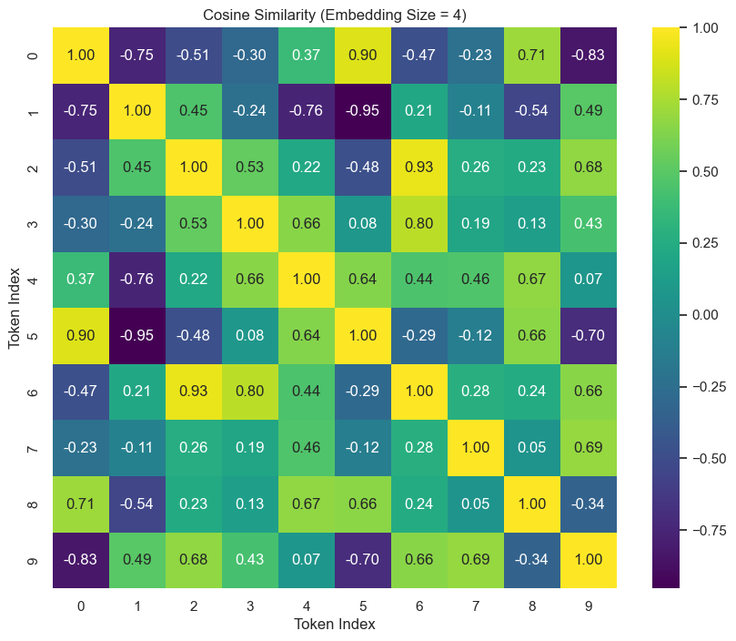
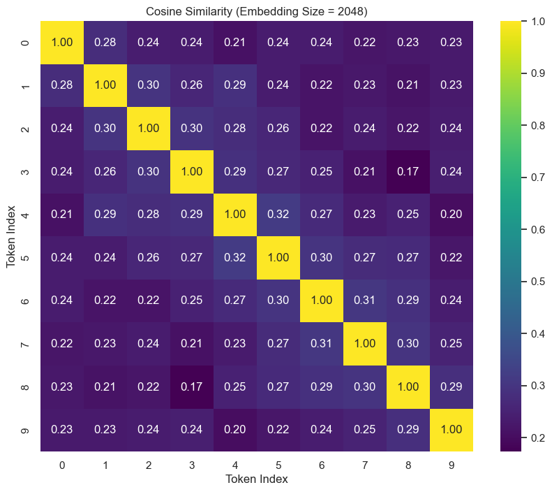
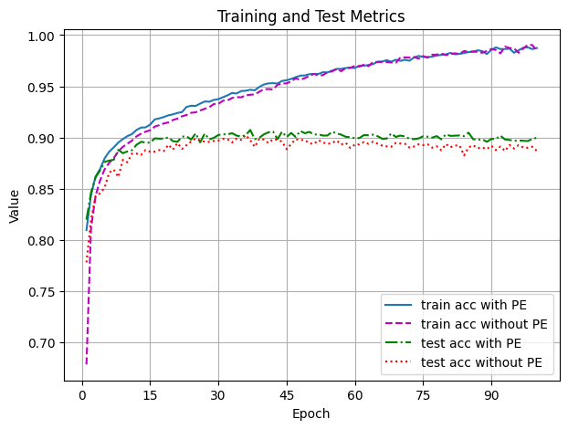
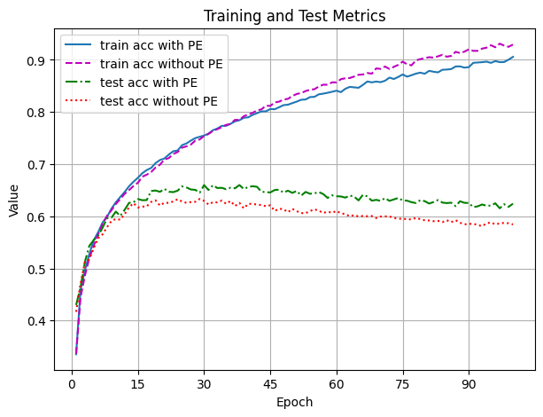
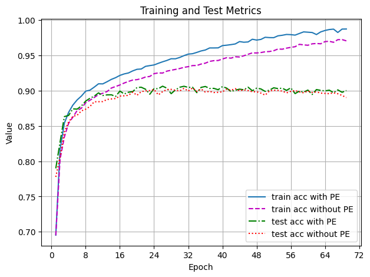
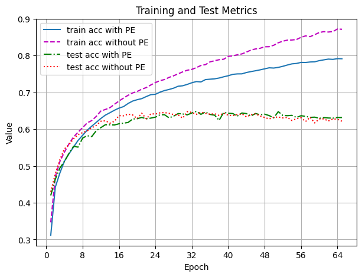
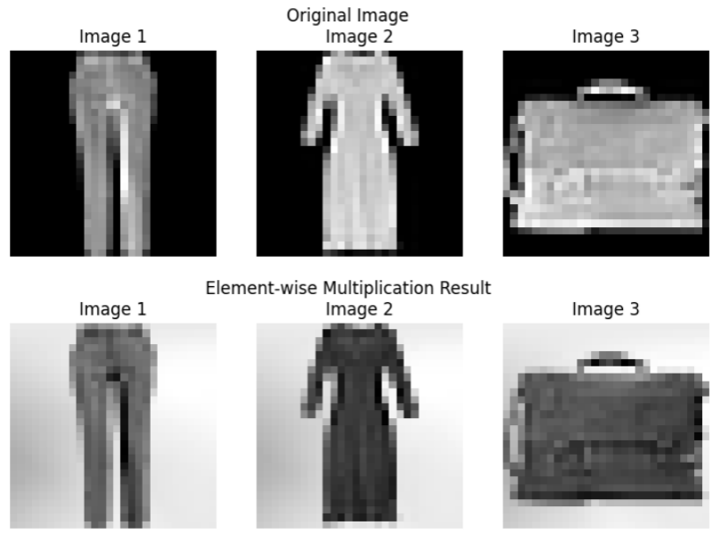
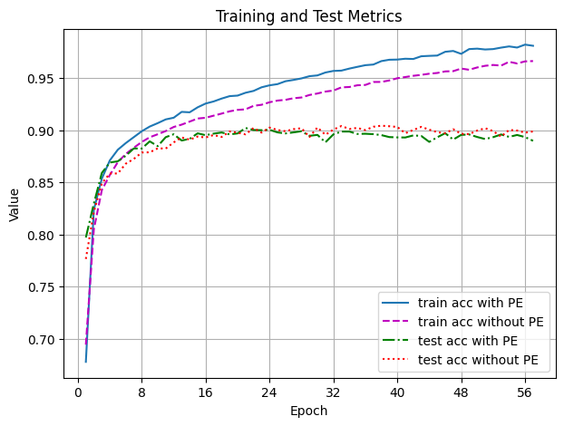
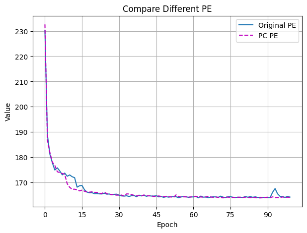

# CNN with SC PE

## 1. 深入transformer的位置编码

我们知道最初始版本的transformer采用的是三角函数进行的绝对位置编码，但是直觉上，在理解语义方面，token与token之间的相对位置关系也至关重要。从数学上，由于三角函数的性质，我大致感觉transformer采用的位置编码在嵌入维度较低时抖动剧烈，但嵌入维度较高时，应该可以表达一部分的相对位置信息。所以我做了以下实验：我设置句子长度为10，使用transformer的三角函数进行位置编码，分别在嵌入维度较低（4）和嵌入维度较高（2048）时得到token与token之间的余弦相似度热图。结果如下：

*设置嵌入维度为4*

*设置嵌入维度为2048*

*图 1: 不同嵌入维度下token之间的相似度热图*

可以看出在嵌入维度较低时，transformer的位置编码无法得到相对位置信息，而在嵌入维度较高时，似乎距离近的两个token之间的相似度相对较高。但是，即使我们假定事实确实是距离较近的token之间的相似度较高，但使用三角函数位置编码的相似度衰减非常快，这也不是我们期望的。

## 2. 动机

卷积神经网络相较于多层感知机在图片分类问题时，先使用指定大小的卷积核，逐步汇集距离相近像素点的像素点矩阵信息，在展平经过线性层进行预测。但是，卷积核显然也存在着一些局限性：它无法同时汇集距离较远的两个像素点的信息。而相较于transformer处理一维的序列，采用二维位置编码，图像本身是二维的，所以如果想要进行位置编码，我们需要在更高的维度寻找。此外，一个自然的问题是，对于图像，我们是使用简单的绝对位置编码还是相对位置编码？我认为应该使用相对位置编码，原因如下：

- 如果我们继续采用三角函数进行位置编码，那相对位置编码的结果就包含了绝对位置编码的信息。
- 设想一个场景：一个足球场，球场上有足球，篮球和球门，足球距离球门很远，篮球距离球门较近。如果仅仅使用卷积核小范围的汇聚像素信息，也许无法很好的将足球和球门联系起来，而足球和球门的配对显然比篮球和球门之间的配对更有助于模型进行分类，而绝对位置编码无法保证每次都正确处理物体与物体之间的位置关系。

## 3. SC PE

既然确定了采用相对位置编码，现在我们只需要找到合适的函数。这里，我采用的是球坐标系来进行相对位置编码。举例来说，对于任意分辨率的图像，我们以左上角第一个像素点为中心点，中心点在球坐标系中方向指向为X轴正方向。位于中心点右侧的像素点，距离每增加1，我们将向量朝Y轴正方向移动一定的角度。位于中心点下方的像素点，距离每增加1，我们将向量朝Z轴正方向移动一定的角度。我们还规定，所有的像素点向量都处于三个坐标都大于0的八分之一球内部，长度都是单位1，仅有方向不同。然后，对于像素位置矩阵，我们先使用线性层（我实验的size为3*128）将三维位置信息映射到一个高维空间，再使用线性层将高维信息映射回低维，最终得到size为(n*n, 1)的位置信息矩阵，其中n为分辨率。最终其与图像经过卷积核再展平之后的矩阵进行cat连接，送入最后的三个线性层进行预测。

## 4. 实验

我使用LeNet分别在Fashion Minist和Cifar10数据集上进行了实验，并对比了使用球坐标位置编码和不使用球坐标位置编码的结果，如下图所示：

*Fashion Minist*

*Cifar10*

*图 2: LeNet在不同数据集下的表现*

结果表明，LeNet加球坐标位置编码在Fashion Minist上测试准确率提高了2%左右，在Cifar10上面提高了4%左右。但是，当我过几天又跑一次之后，结果又如下图所示：

*Fashion Minist*

*Cifar10*

*图 3: 第二次实验结果*

虽然我没有跑满规定的100个epoch，但是大概看出，是不是用球坐标位置编码最终的测试准确性虽然高一点点，但总体应该差不多。这个结果是令人沮丧的，我猜测原因跟矩阵的初始化有关，但我没有任何证据。此外，我们也有一些发现，例如对于Cifar10数据集，使用位置编码的网络最终的测试准确性高于或等于不使用的网络，但训练准确性却相反且差距随着epoch的增多而拉大。

除此之外，我还尝试将得到的size为(n*n, 1)的位置信息矩阵与原像素矩阵进行逐元素相乘，并画图看看结果，如下图所示：

左图是原始图像和像素矩阵与位置信息矩阵对应位置元素相乘的图像结果对比，可以看到，我们的位置信息确定起到了一定的作用。右图是准确性比较，虽然没有跑完规定的100个epoch，但可以看出虽然加了位置编码的训练准确率高一些，但测试准确率差不多。

我们还在transformer中应用了我们的位置编码，结果如下图所示：

*图 4: SC PE in transformer*

可以看到似乎更平滑一些。

## 5. 可以改进的地方

如果我们假设我们的位置编码是有效的，那更进一步思考一下，仍存在一些缺陷，例如，在像素矩阵中，(1,1)，(2,2) 与 (1,2)，(2,1)的相似度相同。

## 6. 期待

我们的实验说明在某些情况下，球坐标位置编码在某些情况下可以提高卷积神经网络的预测效果。同时，根据观察训练过程中的acc的变化，我们猜测，对于越简单的模型，越复杂的数据集，添加球坐标位置编码越可以显著提高预测效果。
