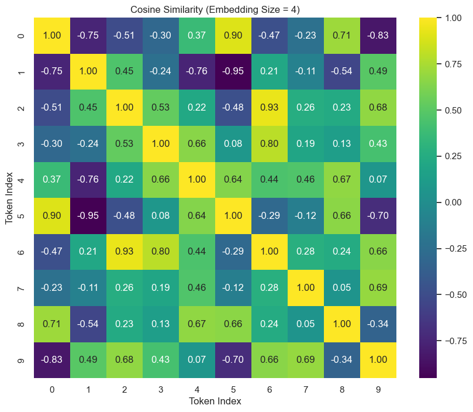
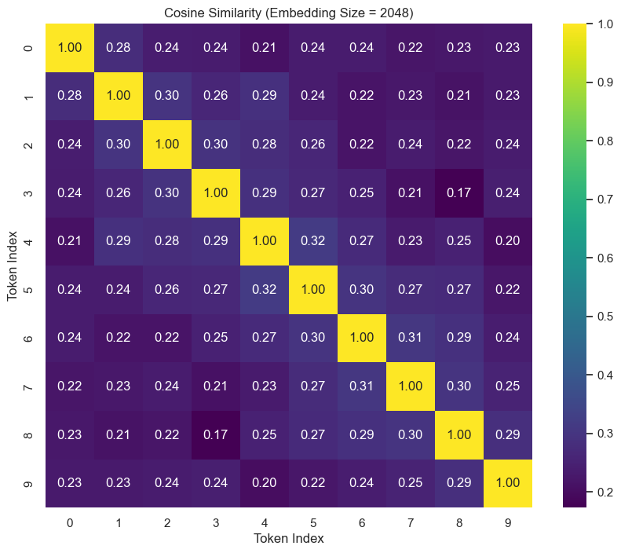
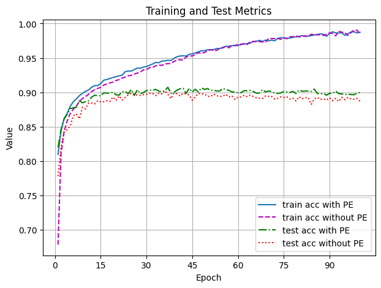
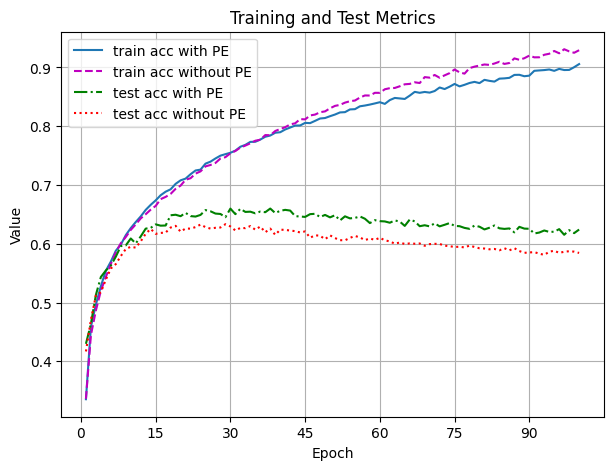
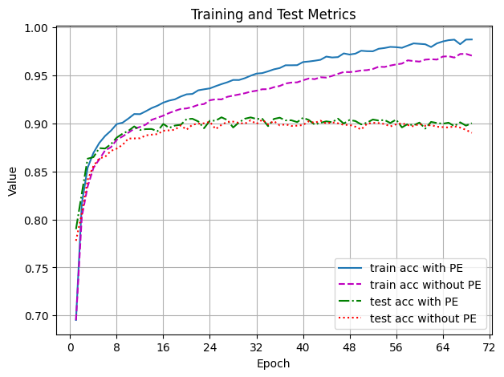
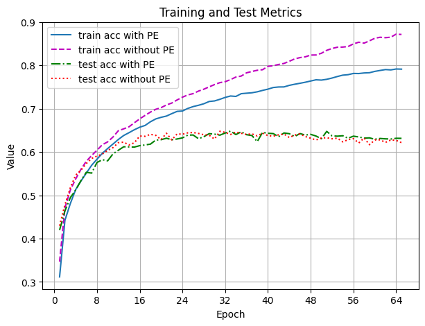
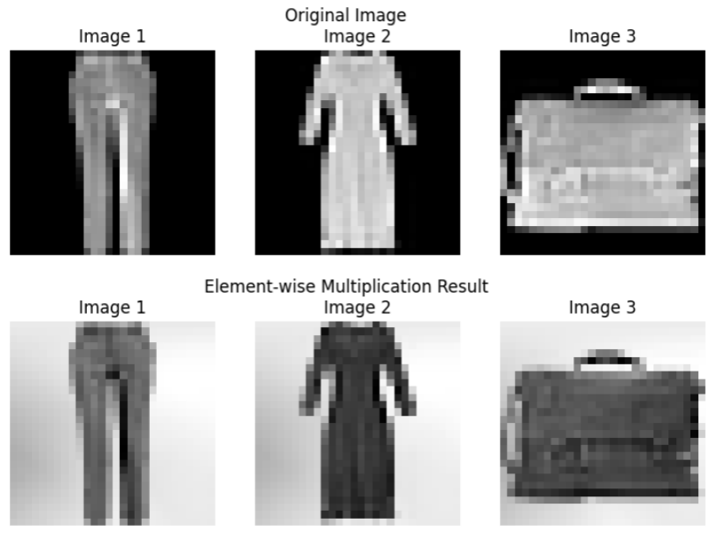
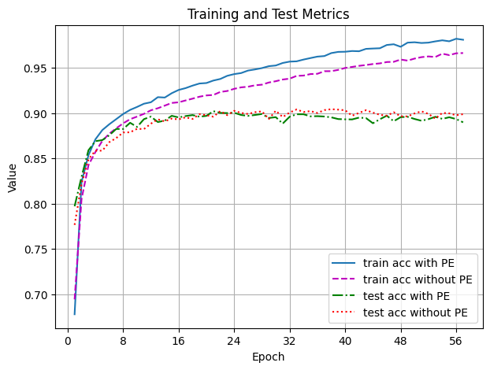
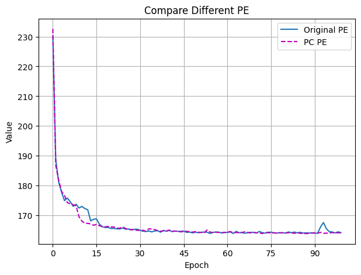

Here's the English translation of the content:

# CNN with SC PE

## 1. Deeper into Transformer's Positional Encoding

We know that the initial version of the transformer used trigonometric functions for absolute positional encoding. Intuitively, the relative positional relationship between tokens is also crucial for understanding semantics. Mathematically, due to the properties of trigonometric functions, I roughly feel that the positional encoding used by transformers fluctuates dramatically at lower embedding dimensions but should be able to express some relative positional information at higher embedding dimensions. So I conducted the following experiment: I set the sentence length to 10, used the transformer's trigonometric function for positional encoding, and obtained cosine similarity heat maps between tokens at both lower (4) and higher (2048) embedding dimensions. The results are as follows:

*Embedding dimension set to 4*

*Embedding dimension set to 2048*

*Figure 1: Similarity heat maps between tokens at different embedding dimensions*

It can be seen that at lower embedding dimensions, the transformer's positional encoding cannot obtain relative positional information, while at higher embedding dimensions, it seems that the similarity between two closer tokens is relatively higher. However, even if we assume that the similarity between closer tokens is indeed higher, the similarity decay using trigonometric function positional encoding is very rapid, which is not what we expect.

## 2. Motivation

Compared to multilayer perceptrons, convolutional neural networks use specified size convolution kernels for image classification problems, gradually aggregating pixel matrix information from nearby pixel points, and then flattening and passing through linear layers for prediction. However, convolution kernels obviously have some limitations: they cannot simultaneously aggregate information from two distant pixel points. Compared to transformers processing one-dimensional sequences using two-dimensional positional encoding, images themselves are two-dimensional, so if we want to perform positional encoding, we need to look for higher dimensions. Additionally, a natural question is whether we should use simple absolute positional encoding or relative positional encoding for images? I believe we should use relative positional encoding for the following reasons:

- If we continue to use trigonometric functions for positional encoding, the result of relative positional encoding will contain the information of absolute positional encoding.
- Imagine a scenario: a football field with a football, a basketball, and a goal. The football is far from the goal, while the basketball is closer to the goal. If we only use convolution kernels to aggregate pixel information in small ranges, we may not be able to associate the football with the goal well. However, the pairing of football and goal is obviously more helpful for model classification than the pairing of basketball and goal, and absolute positional encoding cannot guarantee correct handling of positional relationships between objects every time.

## 3. SC PE

Now that we have decided to use relative positional encoding, we just need to find a suitable function. Here, I use the spherical coordinate system for relative positional encoding. For example, for images of any resolution, we take the first pixel in the upper left corner as the center point, with the center point's direction pointing towards the positive X-axis in the spherical coordinate system. For pixel points to the right of the center point, as the distance increases by 1, we move the vector a certain angle towards the positive Y-axis direction. For pixel points below the center point, as the distance increases by 1, we move the vector a certain angle towards the positive Z-axis direction. We also stipulate that all pixel point vectors are within one-eighth of a sphere where all three coordinates are positive, all have a length of 1 unit, and only differ in direction. Then, for the pixel position matrix, we first use a linear layer (I experimented with a size of 3*128) to map the three-dimensional position information to a high-dimensional space, then use another linear layer to map the high-dimensional information back to low-dimensional, finally obtaining a position information matrix of size (n*n, 1), where n is the resolution. Finally, it is concatenated with the matrix obtained after the image goes through convolution kernels and flattening, and then sent to the last three linear layers for prediction.

## 4. Experiments

I conducted experiments using LeNet on both the Fashion MNIST and CIFAR-10 datasets, comparing the results with and without spherical coordinate positional encoding, as shown in the following figures:

*Fashion MNIST*

*CIFAR-10*

*Figure 2: LeNet performance on different datasets*

The results show that LeNet with spherical coordinate positional encoding improved the test accuracy by about 2% on Fashion MNIST and about 4% on CIFAR-10. However, when I ran it again a few days later, the results were as follows:

*Fashion MNIST*

*CIFAR-10*

*Figure 3: Results of the second experiment*

Although I didn't run the full 100 epochs as specified, it can be roughly seen that whether or not spherical coordinate positional encoding is used, the final test accuracy is slightly higher, but overall should be about the same. This result is disappointing, and I suspect it's related to matrix initialization, but I have no evidence. Additionally, we also have some findings, for example, for the CIFAR-10 dataset, the network using positional encoding has a final test accuracy higher than or equal to the network not using it, but the training accuracy is the opposite, and the gap widens as the number of epochs increases.

In addition, I also tried to multiply the position information matrix of size (n*n, 1) with the original pixel matrix element-wise and plotted the results, as shown in the following figure:

The left image shows a comparison between the original image and the result of element-wise multiplication of the pixel matrix with the position information matrix. It can be seen that our position information has played a certain role. The right image shows a comparison of accuracies. Although the specified 100 epochs were not completed, it can be seen that although the training accuracy with positional encoding is higher, the test accuracies are about the same.

We also applied our positional encoding in transformers, and the results are shown in the following figure:

*Figure 4: SC PE in transformer*

It can be seen that it seems to be smoother.

## 5. Areas for Improvement

If we assume that our positional encoding is effective, further thinking reveals that there are still some deficiencies. For example, in the pixel matrix, the similarities between (1,1), (2,2) and (1,2), (2,1) are the same.

## 6. Expectations

Our experiments show that in some cases, spherical coordinate positional encoding can improve the prediction effect of convolutional neural networks. At the same time, based on observing the changes in accuracy during the training process, we speculate that for simpler models and more complex datasets, adding spherical coordinate positional encoding can significantly improve prediction effects. However, even in what we imagine to be better cases, it seems to have no place in today's increasingly larger models.